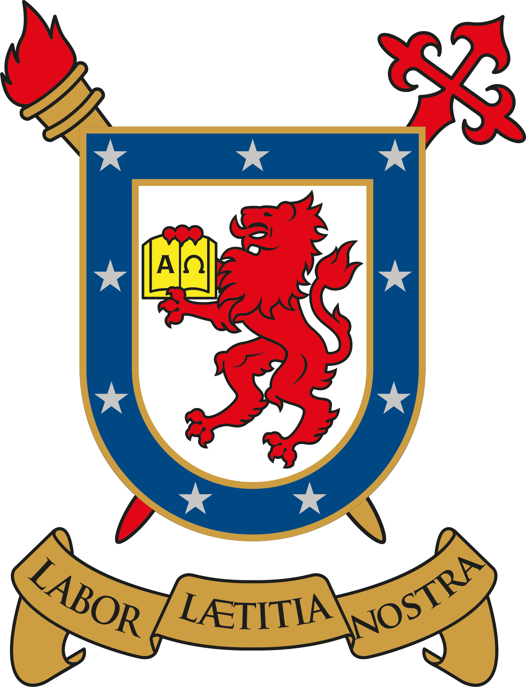
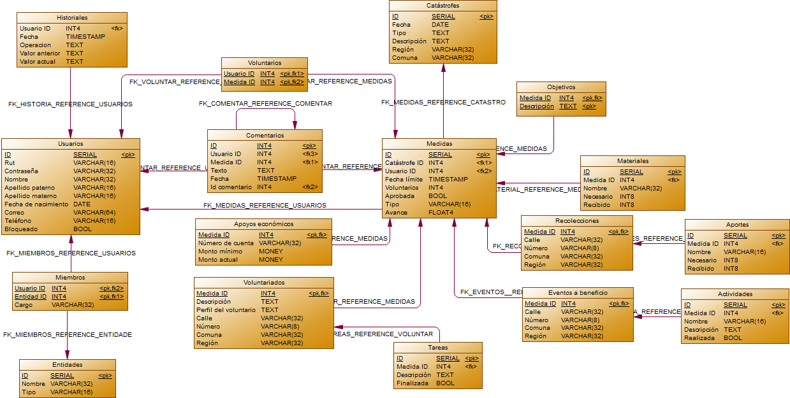

<table style="width: 100%;">
    <tr>
        <td style="text-align: center; text-transform: uppercase; font-weight: bold;">
            Universidad de Santiago de Chile 
            Facultad de Ingeniería 
            Departamento de Ingeniería Informática
        </td>
        <td style="width: auto" height="90px">
           </img>
        </td>
    </tr>
    <tr style="height: 2px;">
        <td style="background-color: #ea7600;"></td>
        <td style="background-color: #002f6c;"></td>
    </tr>
</table>

<i><b>
Diseño de base de datos 1-2017
</b></i>
<i>
Profesores: Carolina Bonacic - Alonso Inostrosa
</i>
<i>
Ayudantes: Matías Vargas - Joaquín Villagra
</i>

# Emergencias ONEMI
"Durante este último tiempo, a causa de la gran cantidad de tragedias ocurridas en el país, la Oficina Nacional de Emergencias (ONEMI) ha solicitado crear un sistema especializado que sea capaz de ingresar la información relativa a las diferentes catástrofes que pudieran suceder, para poder así llevar un registro de lo que está sucediendo en la zona afectada de manera de generar una ayuda conjunta entre las comunidades voluntarias, organizaciones y el gobierno. [...]" [Más información](http://www.udesantiagovirtual.cl/moodle2/pluginfile.php?file=%2F187261%2Fmod_resource%2Fcontent%2F3%2FEnunciado_Dise%C3%B1o_1s2017.pdf)

## Miembros del equipo (Grupo #6)
- Mario Álvarez
- Juan Pablo Martínez
- Diego Mellis
- Andrés Muñoz

## Modelo relacional
</img>